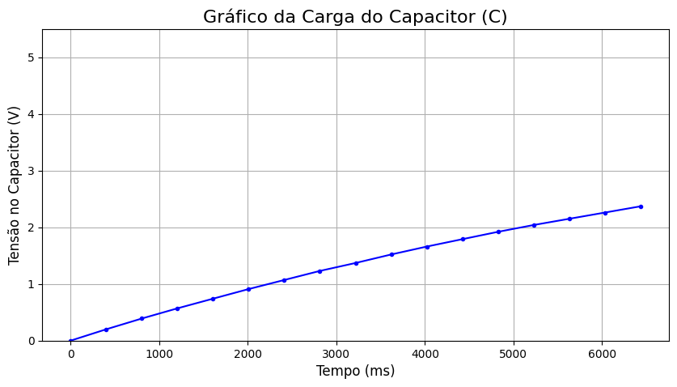
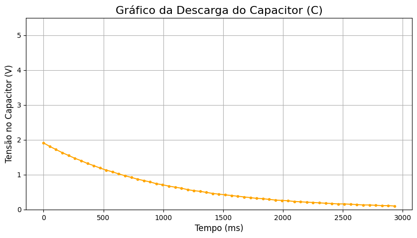
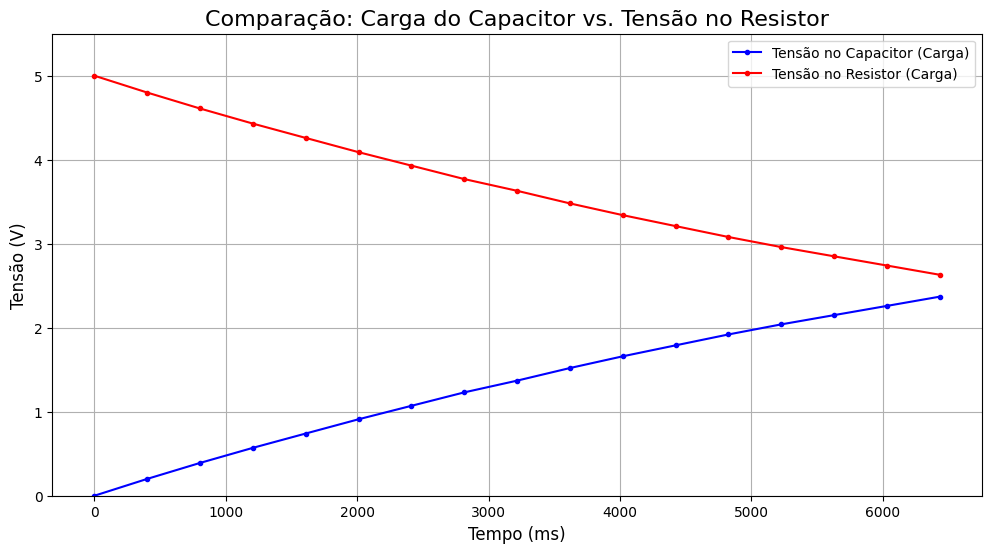
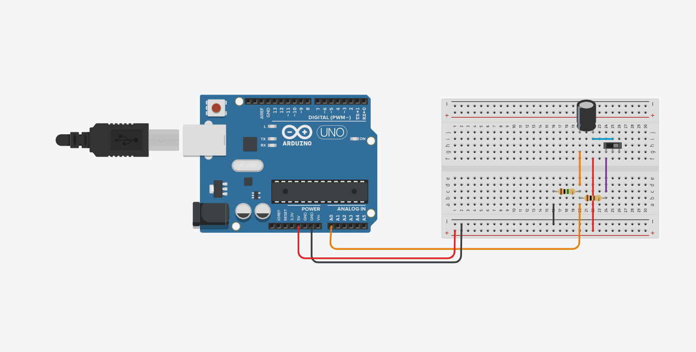

###  Ponderada de Análise de Circuito RC com Arduino
&emsp; Este projeto documenta a análise experimental da carga e descarga de um capacitor em um circuito RC (Resistor-Capacitor), utilizando um Arduino UNO para controle e aquisição de dados. O objetivo foi observar e validar o comportamento teórico das tensões no capacitor e no resistor ao longo do tempo.

&emsp; A simulação e coleta de dados foram realizadas na plataforma Tinkercad, e a análise e visualização dos resultados foram feitas com Python em um notebook Jupyter (codigoPython.ipynb).

#### Resultados do Experimento
&emsp; Os dados coletados pelo Monitor Serial do Arduino foram processados para gerar os gráficos abaixo, que ilustram o comportamento dinâmico do circuito.

&emsp; Resumo dos Parâmetros e Comportamento
Tensão de Alimentação (V_fonte): Aproximadamente 5 V (fornecida pelo Arduino).

&emsp; Comportamento da Tensão no Capacitor (V_C): Durante o processo de carga, a tensão V_C aumentou de forma exponencial, partindo de 0 V e tendendo ao valor da fonte (5 V).

&emsp; Comportamento da Tensão no Resistor (V_R): A tensão V_R exibiu um decaimento exponencial complementar. Partindo de 5 V, ela tendeu a 0 V à medida que o capacitor se carregava.

**Validação do Modelo:** Os resultados experimentais alinham-se de forma consistente com o modelo teórico de um circuito RC de primeira ordem, confirmando a Lei das Malhas de Kirchhoff (V_fonte = V_C + V_R).

#### Gráficos Obtidos
Visão Geral: Curvas de Tensão em V_C e V_R
O gráfico a seguir apresenta a sobreposição das curvas de tensão no capacitor (em azul) e no resistor (em vermelho) durante o ciclo de carga. As curvas são imagens espelhadas, demonstrando que a soma das tensões em ambos os componentes é constante e igual à tensão da fonte.



Evolução da Carga no Capacitor (V_C)
Este gráfico detalha a curva de carga do capacitor. Observa-se o crescimento exponencial da tensão, que se torna mais lento à medida que se aproxima de seu valor máximo.



Evolução da Tensão no Resistor (V_R)
Este gráfico ilustra o decaimento da tensão no resistor de carga (Re) ao longo do tempo. A curva começa no valor máximo (5 V) e decai exponencialmente até zero.



Análise Comparativa: Dados Medidos vs. Modelo Teórico
Ao comparar os dados medidos com as curvas teóricas exponenciais, nota-se uma forte correlação. As pequenas discrepâncias observadas são esperadas em um experimento prático e podem ser atribuídas a fatores como:

- Tolerâncias nos valores nominais do resistor e do capacitor.

- Amostragem de tempo discreta pelo Arduino.

- Ruído inerente ao processo de leitura analógica.

Apesar dessas pequenas variações, o comportamento geral do circuito valida o modelo teórico com sucesso.

### Modelo feito no TinkerCad


&emsp; Circuito experimental projetado para a análise da dinâmica de carga e descarga de um capacitor. A chave (pushbutton) atua como o gatilho manual: quando pressionada, conecta a fonte de 5V ao circuito através do resistor de carga (Re = 1 MΩ), iniciando o processo de carga do capacitor (C = 10 µF). Quando liberada, o resistor de descarga (Rd = 100 Ω) proporciona um caminho para o terra (GND), permitindo que o capacitor se descarregue. O pino analógico A0 do Arduino monitora continuamente a tensão sobre o capacitor (Vc).

### Código C++ (Arduino)

Este é o código utilizado no projeto para a aquisição contínua de dados do circuito.

```cpp
int pinoNoRC = 0;
int valorLido = 0;
float tensaoCapacitor = 0, tensaoResistor;
unsigned long time;

void setup() {
    Serial.begin(9600);
}

void loop() {
    time = millis();
    valorLido = analogRead(pinoNoRC);
    
    // A leitura direta do pino A0 corresponde à tensão no nó, 
    // que neste caso foi associada à tensão do resistor.
    tensaoResistor = (valorLido * 5.0 / 1023);
    
    // A tensão do capacitor é calculada como a diferença em relação à fonte.
    tensaoCapacitor = abs(5.0 - tensaoResistor);

    Serial.print(time);
    Serial.print("; ");
    Serial.print(tensaoResistor);
    Serial.print("; ");
    Serial.println(tensaoCapacitor);
    
    delay(400);
}


